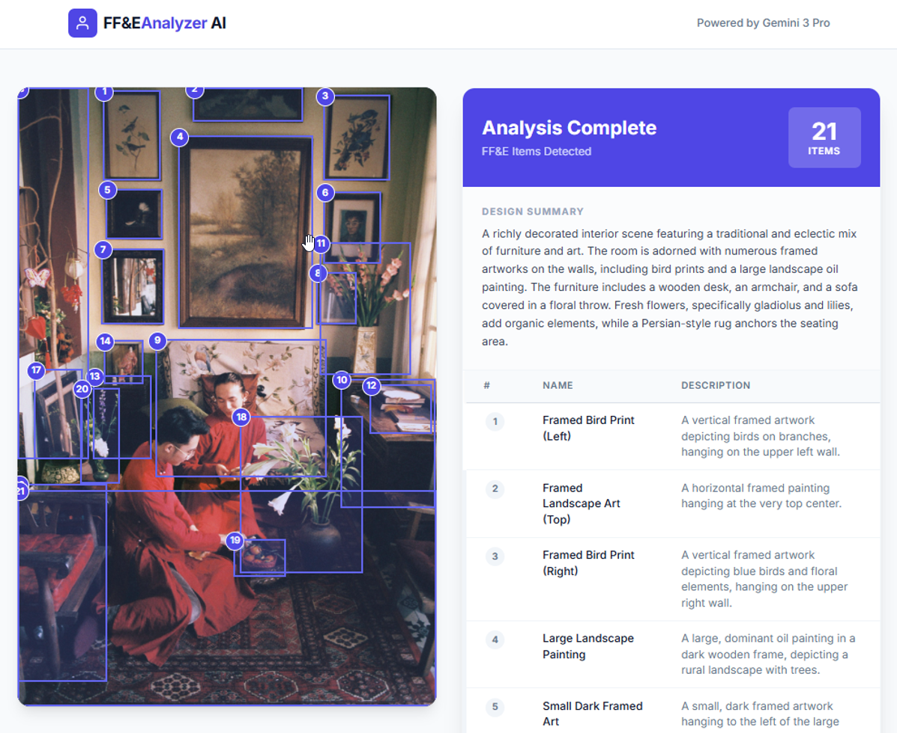

# FF&E Analyzer AI

An intelligent interior design tool that leverages Google's Gemini 2.5 Flash model to identify, count, and localize Furniture, Fixtures, and Equipment (FF&E) in uploaded photos.

## Screenshot



*Example analysis showing detected FF&E items in an interior scene, with bounding boxes highlighting furniture, artwork, and decor elements.*

Photo by [Thai Nguyen Anh](https://unsplash.com/@kyuubei07012008?utm_source=unsplash&utm_medium=referral&utm_content=creditCopyText) on [Unsplash](https://unsplash.com/photos/a-couple-of-women-sitting-next-to-each-other-in-a-living-room-qZaf_d--iB4?utm_source=unsplash&utm_medium=referral&utm_content=creditCopyText)

## Features

- **AI Object Detection**: Automatically identifies furniture, lighting, and decor items in interior images.
- **Visual Localization**: Draws precise bounding boxes around detected items to visualize placement.
- **Detailed Analysis**: Provides a specific label and visual description (material, color, style) for each item.
- **Design Summary**: Generates a brief overview of the room's style and collection.
- **Export to Excel**: Download the analyzed inventory list as a CSV file for reporting.

## Tech Stack

- **Frontend**: React 19, TypeScript
- **Styling**: Tailwind CSS
- **AI Model**: Google Gemini 2.5 Flash (via `@google/genai` SDK)

## Prerequisites

- **Node.js**: v18 or higher
- **Google Gemini API Key**: Obtain one from [Google AI Studio](https://aistudio.google.com/apikey)

## Getting Started

1. **Clone the repository**
   ```bash
   git clone https://github.com/EyalIv/ffe-analyzer-ai.git
   cd ffe-analyzer-ai
   ```

2. **Install dependencies**
   ```bash
   npm install
   ```

3. **Set up your API key**
   
   Create a `.env` file in the root directory:
   ```env
   GEMINI_API_KEY=your_api_key_here
   ```

4. **Run the development server**
   ```bash
   npm run dev
   ```

5. **Open your browser** and navigate to `http://localhost:5173`

## How It Works

1.  **Image Upload**: The user provides an image of a room or specific furniture piece.
2.  **Gemini Analysis**: The image is sent to the Gemini 3 Pro model with a specialized system instruction to act as an FF&E expert.
3.  **Data Extraction**: The model returns a structured JSON response containing:
    *   A list of items with labels and descriptions.
    *   2D bounding box coordinates for each item.
    *   A summary of the design.
4.  **Visualization**: The app renders the bounding boxes over the original image and populates a data table.
5.  **Export**: Data is formatted into a CSV structure for easy export to Excel.

## Usage

1.  **Upload**: Drag and drop or select an interior design photo.
2.  **Analyze**: Wait for the AI to process the image and identify objects.
3.  **Review**: Hover over the bounding boxes to see labels, or check the table for full descriptions.
4.  **Export**: Click "Download Excel Report" to save the data.

## License

This project is open source and available under the [MIT License](LICENSE).
